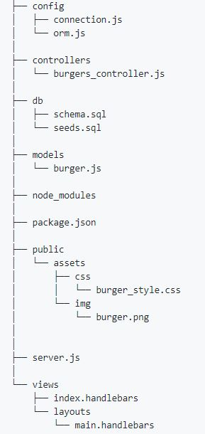

# Eat-Da-Burger
Eat-Da-Burger! is a restaurant app that lets users input the names of burgers they'd like to eat
For this  restaurant app, first i needed to create few directories and initial setup. My folder has structured as below format:
(PhaseI)
          

Phase(II):
I have installed express, express-handlebars, body-parser, mysql packages.
Inside db i have created database with burgers table.
Then I have created db using "MYSQL Workbench" app.
Then i have created Config, Model, Controller and View Setups.
Phase(III):
Finally i have added all my codes to run this app with desired needs of users by using MySQL, Node, Express, Handlebars and ORM